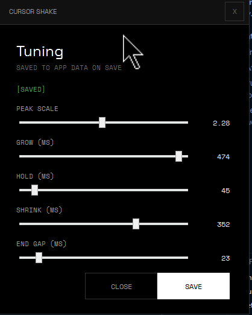

# Cursor Shake

Windows tray utility that detects a **vigorous horizontal mouse shake** and briefly shows an enlarged copy of the current cursor as visual feedback. Animation timing and scale are adjustable from a **Settings** window.



## Requirements

- **Windows** (uses a low-level mouse hook and a transparent WPF overlay)
- [.NET 10](https://dotnet.microsoft.com/download) (SDK to build and run)

## Install from Releases

The **MSI** in this repository’s **GitHub Releases** is a **simple Windows Installer** package. It installs the app **for the current user only** (per-user scope): no administrator elevation is required for a normal install, and files go under your user profile (for example `%LocalAppData%\Programs\CursorShake`). Uninstall it like any other app from **Settings → Apps** or **Apps & features**.

## Run

From the repository root:

```powershell
dotnet run --project CursorShake/CursorShake.App.csproj
```

Or build and start the published executable:

```powershell
dotnet build CursorShake/CursorShake.App.csproj -c Release
.\CursorShake\bin\Release\net10.0-windows\CursorShake.App.exe
```

Prefer running the built **`.exe`** so the process host matches the app (the mouse hook is more reliable than when only `dotnet` hosts the DLL).

## Tray menu

- **Settings** — open animation tuning (peak scale, grow / hold / shrink / end gap in milliseconds). Values are saved under `%LocalAppData%\CursorShake\settings.json`.
- **Exit** — quit the app.

## Triggering the effect

Move the mouse **quickly left and right** several times with enough horizontal travel. The detector looks for direction changes and span over a short sliding window; it also enforces a short cooldown between triggers so the overlay does not spam.

## Project layout

| Path | Role |
|------|------|
| `CursorShake/` | WPF app, tray, overlay, settings UI |
| `CursorShake.Core/` | Mouse hook, shake detection |
| `CursorShake.Infrastructure/` | Placeholder / future infrastructure |

## Build

```powershell
dotnet build CursorShake.slnx
```

## Support

If you find this project useful, you can [buy me a coffee](https://buymeacoffee.com/carlosx).
