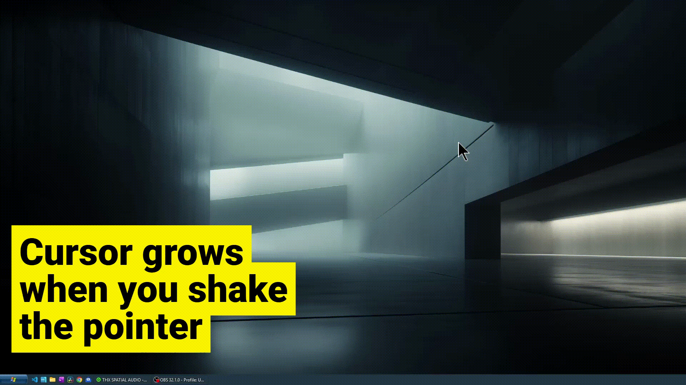

# Cursor Shake

Windows tray utility that detects a **vigorous horizontal mouse shake** and briefly shows an enlarged copy of the current cursor as visual feedback. It also includes an optional **annotation bar** (per monitor) with a fullscreen drawing overlay and **screenshot-to-clipboard** (PRT) with optional border and drop shadow.




## Requirements

- **Windows** (low-level mouse hook, transparent WPF overlays)
- [.NET 10](https://dotnet.microsoft.com/download) (SDK to build and run)

## Install from Releases

The **MSI** in this repository’s **GitHub Releases** is a **simple Windows Installer** package. It installs the app **for the current user only** (per-user scope): no administrator elevation is required for a normal install, and files go under your user profile (for example `%LocalAppData%\Programs\CursorShake`). Uninstall it like any other app from **Settings → Apps** or **Apps & features**.

## Run

From the repository root:

```powershell
dotnet run --project CursorShake/CursorShake.App.csproj
```

Or build and start the published executable:

```powershell
dotnet build CursorShake/CursorShake.App.csproj -c Release
.\CursorShake\bin\Release\net10.0-windows\CursorShake.App.exe
```

Prefer running the built **`.exe`** so the process host matches the app (the mouse hook is more reliable than when only `dotnet` hosts the DLL).

## Tray menu

- **Settings** — animation tuning (peak scale, grow / hold / shrink / end gap in milliseconds) and **screenshot** options (optional border and drop shadow on clipboard captures, with a white mat behind the shadow). Values are saved under `%LocalAppData%\CursorShake\settings.json`.
- **Screenshot** — copy the monitor under the cursor, pick a **region** (magnified selector), or repeat the **previous region** (after you have captured one once). Does not require opening the annotation overlay.
- **Annotation bar** — show or hide the thin per-monitor dock at the bottom of each display.
- **Exit** — quit the app.

## Triggering the shake effect

Move the mouse **quickly left and right** several times with enough horizontal travel. The detector looks for direction changes and span over a short sliding window; it also enforces a short cooldown between triggers so the overlay does not spam.

## Annotation bar and overlay

When **Annotation bar** is enabled, hover the strip at the bottom of a monitor to expand tools: **LINE**, **ARROW**, **RECT**, **TEXT**, **PRT**, color swatches, **UNDO** / **REDO**, and **Escape** to close the fullscreen canvas.

- Choosing a drawing tool opens a **fullscreen overlay** on that monitor for markup. **PRT** can copy the whole monitor, a dragged region, or the last used region; on success the overlay can close (depending on flow).
- **PRT** is also on the tray **Screenshot** menu and on the dock without opening the drawing overlay.

## Project layout

| Path | Role |
|------|------|
| `CursorShake/` | WPF app: tray, cursor overlay, settings, annotation dock/canvas, region picker, clipboard toast |
| `CursorShake.Core/` | Mouse hook, shake detection |
| `CursorShake.Infrastructure/` | Placeholder / future infrastructure |
| `installer/` | WiX MSI project |

## Build

```powershell
dotnet build CursorShake.slnx
```

## Support

If you find this project useful, you can [buy me a coffee](https://buymeacoffee.com/carlosx).
